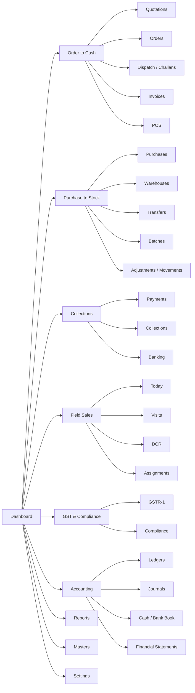

# Workflow-Centered + Power-User Wireframe Specification

**Date**: 2026-03-27  
**Purpose**: Define the end-to-end visual wireframe system for the current app using a workflow-centered information architecture with power-user workspaces inside each workflow.  
**Status**: Decision-ready UX specification for product review

Sources:

- [CURRENT_IMPLEMENTATION_STATE.md](/Users/tanmoybhadra/Documents/Mrinmoy_Work/GST_BILLING_SOFTWARE/docs/CURRENT_IMPLEMENTATION_STATE.md)
- [MARG_DISTRIBUTION_PARITY_MASTER_SPEC.md](/Users/tanmoybhadra/Documents/Mrinmoy_Work/GST_BILLING_SOFTWARE/docs/MARG_DISTRIBUTION_PARITY_MASTER_SPEC.md)
- [CUSTOMER_DETAIL_V2_SPEC.md](/Users/tanmoybhadra/Documents/Mrinmoy_Work/GST_BILLING_SOFTWARE/docs/CUSTOMER_DETAIL_V2_SPEC.md)
- current route inventory in `apps/web/src/app`

---

## 1. Thesis

### Visual thesis

Build the app like a calm distribution control room: matte operational surfaces, sharp typography, one warm action accent, and dense layouts that still breathe.

### Content plan

1. orient the operator immediately
2. surface the active workflow, queue, or exception
3. expose detail through segmented tabs, not stacked cards
4. keep next actions visible without flooding the page

### Interaction thesis

1. the workflow rail should feel like switching desks, not just switching links
2. segmented tabs should pin and persist so users always know which layer they are in
3. inspectors, drawers, and right rails should reveal depth without forcing full page hops for every detail

---

## 2. Product UX Direction

This app should **not** feel like:

- a SaaS card grid
- a long vertical form dump
- a generic admin dashboard

This app **should** feel like:

- a workflow-led wholesale operating system
- an environment where billing, dispatch, collections, stock, and compliance are connected
- a tool made for teams who work all day inside tables, queues, exceptions, and document lifecycles

The chosen model is:

- `Workflow-centered` for the primary navigation
- `Power-user` inside the working surfaces
- `Segmented tabs` for detail pages and layered entity views

---

## 3. Core UX Principles

1. One page, one working job.
   A page should either monitor, decide, edit, reconcile, or review. It should not try to do all five.

2. Tabs before stacks.
   If a screen currently shows profile, transactions, ledger, route coverage, and settings in one long page, it must be split into tabs.

3. Lists are primary, cards are secondary.
   The core UX unit for distributor software is the queue, table, or timeline, not the marketing card.

4. Headers should be brief and operational.
   The top of the page should answer:
   - where am I
   - what is the status
   - what action matters now

5. Context belongs in side rails.
   Secondary metadata, warnings, linked docs, and activity history should live in a right rail or inspector, not inside the main transaction grid.

6. Every workflow needs an exception view.
   Distributor teams spend as much time on mismatches, overdue, pending dispatch, blocked credit, and batch risk as on happy-path creation.

---

## 4. Global App Shell

## 4.1 Shell structure

```
+----------------------------------------------------------------------------------+
| Top command bar: company | search | quick create | notifications | user         |
+----------------------+-----------------------------------------------------------+
| Workflow rail        | Sub-workflow strip                                         |
|                      +-----------------------------------------------------------+
| Dashboard            | Page header: title | status | filters | primary action    |
| Order to Cash        +-----------------------------------------------------------+
| Purchase to Stock    | Sticky context band: KPIs / warnings / selected scope      |
| Collections          +-----------------------------------------------------------+
| Field Sales          | Main workspace                                              |
| GST & Compliance     |                                                           |
| Accounting           |                                                           |
| Reports              |                                                           |
| Masters              |                                                           |
| Settings             |                                                           |
|----------------------|---------------------------------------------+-------------|
| Optional recent      | Primary work area                            | Inspector   |
| items / shortcuts    | queue / table / detail / form                | / side rail |
+----------------------+---------------------------------------------+-------------+
```

## 4.2 Navigation model

Primary left workflow rail:

- Dashboard
- Order to Cash
- Purchase to Stock
- Collections
- Field Sales
- GST & Compliance
- Accounting
- Reports
- Masters
- Settings

Top command bar:

- company switch
- global search
- quick create
- recent items
- notifications
- profile

Secondary strip under the main rail:

- changes based on selected workflow
- stays visible within the workflow
- acts like the local map

Example for `Order to Cash`:

- Overview
- Quotations
- Orders
- Dispatch
- Invoices
- POS
- Returns

Example for `Purchase to Stock`:

- Overview
- Purchases
- Warehouses
- Transfers
- Batches
- Movements
- Adjustments

---

## 5. Visual Language

### Typography

- primary UI face: modern grotesk or industrial sans with crisp numerals
- secondary face: optional condensed utility face for table headers, counts, and operational labels
- headings should feel firm, not soft

### Color system

- base: warm off-white / graphite / muted steel
- accent: one assertive operational tone, preferably amber or deep cobalt
- states:
  - success: restrained green
  - warning: ochre
  - danger: oxide red
  - info: muted blue

### Density

- medium-high density for tables and dashboards
- low chrome
- shallow separators instead of heavy card borders
- cards only when the card itself is the interaction

### Motion

- quick workflow-strip transitions
- sticky KPI band that compresses on scroll
- right-rail or inspector reveal for linked detail

---

## 6. Shared Page Archetypes

Every current route should map to one of these archetypes.

## A. Workflow overview

Use for:

- dashboard
- workflow landing pages
- major report hubs

Wireframe:

```
+-------------------------------------------------------------------------------+
| Header: workflow title | date range | team scope | primary action             |
+-------------------------------------------------------------------------------+
| KPI band: 4-6 key numbers with status, not decorative cards                  |
+-------------------------------------------------------------------------------+
| Left: priority queues                | Center: trend or status table          |
| - pending approvals                  | - bottleneck list                       |
| - overdue exceptions                 | - throughput / aging                    |
| - blocked documents                  |                                         |
|--------------------------------------+----------------------------------------|
| Bottom: recent activity / team feed / unresolved items                        |
+-------------------------------------------------------------------------------+
```

## B. Queue + inspector

Use for:

- quotations list
- orders list
- invoices list
- dispatch
- collections
- banking match
- warehouse transfers

Wireframe:

```
+-------------------------------------------------------------------------------+
| Header: page title | saved view | filters | export | create                    |
+-------------------------------------------------------------------------------+
| Sticky segment bar: All | Pending | Exception | Mine | Closed                  |
+-------------------------------------------------------------------------------+
| Main list/table                              | Inspector / selected row        |
|----------------------------------------------+---------------------------------|
| columns, bulk actions, row states            | summary                         |
| inline badges, due dates, totals             | linked docs                     |
| compact row hover actions                    | activity                        |
|                                              | next actions                    |
+-------------------------------------------------------------------------------+
```

## C. Detail with segmented tabs

Use for:

- customer detail
- supplier detail
- product detail
- quotation detail
- sales order detail
- invoice detail
- purchase detail
- challan detail
- journal detail

Wireframe:

```
+-------------------------------------------------------------------------------+
| Header: entity name / number | status | actions                               |
+-------------------------------------------------------------------------------+
| Context strip: owner | warehouse | due | total | compliance | warnings         |
+-------------------------------------------------------------------------------+
| Tabs: Overview | Transactions | Operations | Financials | History | Settings    |
+-------------------------------------------------------------------------------+
| Main tab content                                 | Context rail                 |
|                                                   | alerts                      |
|                                                   | linked records              |
|                                                   | timeline                    |
|                                                   | shortcuts                   |
+-------------------------------------------------------------------------------+
```

## D. Composer / create screen

Use for:

- new quotation
- new order
- new invoice
- new purchase
- new customer
- new product

Wireframe:

```
+-------------------------------------------------------------------------------+
| Header: New document | draft state | save draft | primary submit               |
+-------------------------------------------------------------------------------+
| Step strip: Party | Items | Terms | Review                                       |
+-------------------------------------------------------------------------------+
| Main form canvas                                 | Live summary rail            |
| - only current step fields                        | totals                       |
| - large table for items                           | stock/credit signals         |
| - no endless vertical dump                        | warnings                     |
|                                                   | linked scheme/batch rules    |
+-------------------------------------------------------------------------------+
```

## E. Explorer / report surface

Use for:

- distributor reports
- GST reports
- accounting reports
- outstanding

Wireframe:

```
+-------------------------------------------------------------------------------+
| Header: report title | date | scope | compare | export                         |
+-------------------------------------------------------------------------------+
| Variable bar: group by | segment | salesperson | warehouse | gst bucket        |
+-------------------------------------------------------------------------------+
| Summary strip                                                                  |
+-------------------------------------------------------------------------------+
| Main visualization / pivot / result table                                      |
+-------------------------------------------------------------------------------+
| Bottom tabs: Details | Exceptions | Export history                             |
+-------------------------------------------------------------------------------+
```

## F. Settings studio

Use for:

- company settings
- pricing
- roles
- users
- notifications
- migrations
- templates
- integrations

Wireframe:

```
+-------------------------------------------------------------------------------+
| Header: setting area | status | save                                           |
+-------------------------------------------------------------------------------+
| Left setting nav: profile / commercial / compliance / automation / access      |
|----------------------------------------------+---------------------------------|
| Main setup pane                               | Explain / preview rail          |
| segmented sections                            | impact notes                    |
| input groups                                  | examples                        |
| validation feedback                           | last changed                    |
+-------------------------------------------------------------------------------+
```

## G. Print / read-only surface

Use for:

- receipt print
- challan print
- PDFs

Wireframe:

```
+-------------------------------------------------------------------------------+
| Utility bar: print | download | close                                          |
+-------------------------------------------------------------------------------+
| Paper canvas / print artifact                                                     |
+-------------------------------------------------------------------------------+
```

---

## 7. Workflow Map



---

## 8. End-to-End Wireframes By Workflow

## 8.1 Dashboard

### `/c/[companyId]/dashboard`

Archetype:

- `Workflow overview`

Structure:

- top KPI strip:
  - today billing
  - receivable at risk
  - pending dispatch
  - low stock / near expiry
  - GST or compliance exceptions
- left column:
  - blocked credit customers
  - overdue collection actions
  - dispatch pending today
- center:
  - order to cash funnel
  - purchase to stock bottlenecks
- right rail:
  - recent documents
  - quick create
  - alerts

Decision:

- the dashboard should be operational, not inspirational

---

## 8.2 Order to Cash

### `/sales/quotations`

- archetype: `Queue + inspector`
- tabs:
  - All
  - Draft
  - Sent
  - Expiring
  - Converted
- inspector:
  - customer
  - total
  - expiry
  - pricing source
  - conversion actions

### `/sales/quotations/new`

- archetype: `Composer / create screen`
- steps:
  - Customer
  - Items
  - Commercials
  - Review
- right rail:
  - scheme preview
  - margin signal
  - credit note if customer risky

### `/sales/quotations/[quotationId]`

- archetype: `Detail with segmented tabs`
- tabs:
  - Overview
  - Items
  - Commercials
  - Conversion
  - Activity

### `/sales/orders`

- archetype: `Queue + inspector`
- tabs:
  - All
  - Open
  - Partially fulfilled
  - Ready for dispatch
  - Completed
- row emphasis:
  - fulfillment progress
  - warehouse
  - salesperson
  - next dispatch need

### `/sales/orders/new`

- archetype: `Composer / create screen`
- steps:
  - Party
  - Items
  - Availability
  - Review

### `/sales/orders/[salesOrderId]`

- archetype: `Detail with segmented tabs`
- tabs:
  - Summary
  - Items
  - Dispatch
  - Invoice Link
  - Activity

### `/sales/dispatch`

- archetype: `Queue + inspector`
- tabs:
  - To pick
  - To pack
  - To dispatch
  - Delivered not invoiced
  - Exceptions
- main layout:
  - left dense queue
  - right operational inspector
- inspector fields:
  - challan
  - warehouse
  - vehicle/transporter
  - short supply
  - invoice conversion readiness

### `/sales/challans`

- archetype: `Queue + inspector`
- tabs:
  - Draft
  - Packed
  - Dispatched
  - Delivered
  - Cancelled

### `/sales/challans/[challanId]`

- archetype: `Detail with segmented tabs`
- tabs:
  - Overview
  - Line status
  - Transport
  - Invoice Link
  - History

### `/sales/challans/[challanId]/print`

- archetype: `Print / read-only surface`

### `/sales/invoices`

- archetype: `Queue + inspector`
- tabs:
  - Draft
  - Issued
  - Overdue
  - Paid
  - Cancelled
  - Compliance issues
- inspector:
  - balance due
  - IRN/EWB state
  - payment state
  - linked order / challan

### `/sales/invoices/new`

- archetype: `Composer / create screen`
- steps:
  - Party
  - Items
  - Stock / Batch
  - Compliance
  - Review
- right rail:
  - credit signal
  - batch allocation
  - scheme resolution
  - e-invoice eligibility

### `/sales/invoices/[invoiceId]`

- archetype: `Detail with segmented tabs`
- tabs:
  - Summary
  - Items
  - Payments
  - Compliance
  - Linked docs
  - Audit

### `/pos`

- archetype: `Workflow overview`
- purpose:
  - route selector between billing and receipt history

### `/pos/billing`

- archetype: `Power-user composer`
- layout:
  - left product keypad / search
  - center bill line table
  - right total and checkout rail
- not a card stack

### `/pos/receipt/[invoiceId]`

- archetype: `Print / read-only surface`

---

## 8.3 Purchase to Stock

### `/purchases`

- archetype: `Queue + inspector`
- tabs:
  - Draft
  - Received
  - Payable
  - Returned
  - Cancelled

### `/purchases/new`

- archetype: `Composer / create screen`
- steps:
  - Supplier
  - Items
  - Batch receive
  - Review

### `/purchases/[purchaseId]`

- archetype: `Detail with segmented tabs`
- tabs:
  - Summary
  - Items
  - Batches
  - Payments
  - Returns
  - Audit

### `/inventory`

- archetype: `Workflow overview`
- KPI strip:
  - stock value
  - low stock
  - near expiry
  - transfer in transit
- lower regions:
  - warehouse health
  - batch risk
  - movement exceptions

### `/inventory/warehouses`

- archetype: `Queue + inspector`
- tabs:
  - All warehouses
  - Capacity issues
  - Default / active

### `/inventory/transfers`

- archetype: `Queue + inspector`
- tabs:
  - Requested
  - Dispatched
  - In transit
  - Received
  - Exceptions

### `/inventory/batches`

- archetype: `Queue + inspector`
- tabs:
  - Active
  - Near expiry
  - Expired
  - Clearance
- emphasis:
  - FEFO issue priority
  - warehouse
  - qty remaining

### `/inventory/movements`

- archetype: `Explorer / report surface`
- tabs:
  - All movements
  - Sales issue
  - Purchase receive
  - Transfer
  - Adjustment

### `/inventory/adjustments`

- archetype: `Queue + composer hybrid`
- left:
  - past adjustments
- right:
  - compact adjustment form

---

## 8.4 Collections

### `/payments`

- archetype: `Queue + inspector`
- tabs:
  - All receipts
  - Pending instrument
  - Cleared
  - Bounced
  - Unreconciled

### `/payments/collections`

- archetype: `Queue + inspector`
- tabs:
  - Overdue today
  - Promise to pay
  - Open tasks
  - Escalations
  - Closed
- inspector:
  - customer snapshot
  - latest invoice
  - last payment
  - next action

### `/payments/banking`

- archetype: `Queue + inspector`
- tabs:
  - Bank accounts
  - Statement imports
  - To match
  - Matched
  - Exceptions
- layout:
  - left statement line list
  - center candidate match table
  - right selected payment / line inspector

---

## 8.5 Field Sales

### `/sales/field/today`

- archetype: `Queue + inspector`
- tabs:
  - Planned
  - In progress
  - Missed
  - Ad hoc
- mobile first
- rows should be large targets, not tiny table lines

### `/sales/field/visits/[visitId]`

- archetype: `Detail with segmented tabs`
- tabs:
  - Visit summary
  - Outcomes
  - Orders / quotes
  - Collection follow-up
  - Timeline

### `/sales/field/dcr`

- archetype: `Workflow overview`
- top:
  - daily counts
  - productive vs non-productive
- lower:
  - rep list or route performance

### `/settings/sales/assignments`

- archetype: `Settings studio`
- tabs:
  - Territories
  - Routes
  - Beats
  - Coverage
  - Salesperson assignment

---

## 8.6 GST & Compliance

### `/reports/gst/gstr1`

- archetype: `Explorer / report surface`
- top variable bar:
  - period
  - section
  - export
- result tabs:
  - Summary
  - Invoice rows
  - HSN
  - Exceptions

### `/reports/gst/compliance`

- archetype: `Queue + inspector`
- tabs:
  - E-invoice pending
  - E-way bill pending
  - Failed
  - Cancelled
  - Synced
- inspector:
  - document
  - reason
  - retry action

### invoice compliance inside `/sales/invoices/[invoiceId]`

- use the `Compliance` tab, not a giant inline panel in overview

---

## 8.7 Accounting

### `/accounting`

- archetype: `Workflow overview`
- regions:
  - books snapshot
  - journal health
  - month-end alerts
  - lock period summary

### `/accounting/ledgers`

- archetype: `Queue + inspector`
- tabs:
  - All ledgers
  - Customer
  - Supplier
  - Bank
  - Tax

### `/accounting/journals`

- archetype: `Queue + inspector`
- tabs:
  - Draft
  - Posted
  - Reversal

### `/accounting/journals/[journalId]`

- archetype: `Detail with segmented tabs`
- tabs:
  - Summary
  - Lines
  - Links
  - Audit

### `/accounting/books/cash`
### `/accounting/books/bank`

- archetype: `Explorer / report surface`
- tabs:
  - Book
  - Day summary
  - Exceptions

### financial statement routes

- `/accounting/reports/trial-balance`
- `/accounting/reports/profit-loss`
- `/accounting/reports/balance-sheet`

all use:

- archetype: `Explorer / report surface`
- tabs:
  - Summary
  - Detailed lines
  - Export

---

## 8.8 Reports

### `/reports`

- archetype: `Workflow overview`
- grouped by business question, not just raw modules:
  - Sales
  - Stock
  - Collections
  - Compliance
  - Team
  - Finance

### distributor report routes

- `/reports/distributor/analytics`
- `/reports/distributor/commercial`
- `/reports/distributor/dispatch`
- `/reports/distributor/routes`
- `/reports/distributor/dcr`
- `/reports/distributor/sales-team`

all use:

- archetype: `Explorer / report surface`
- consistent bar:
  - date
  - salesperson
  - route
  - warehouse
  - export

### other report routes

- `/reports/outstanding`
- `/reports/credit-control`
- `/reports/sales-summary`
- `/reports/purchases-summary`
- `/reports/profit-snapshot`
- `/reports/top-products`

all use:

- archetype: `Explorer / report surface`
- results should default to table + summary strip, not stacked cards

---

## 8.9 Masters

### `/masters/customers`

- archetype: `Queue + inspector`
- tabs:
  - All
  - Active
  - On hold
  - Overdue
  - Route assigned
- inspector:
  - balance
  - last invoice
  - salesperson
  - route

### `/masters/customers/new`

- archetype: `Composer / create screen`
- steps:
  - Identity
  - Commercial
  - Addresses
  - Review

### `/masters/customers/[customerId]`

- archetype: `Detail with segmented tabs`
- tabs:
  - Overview
  - Sales
  - Collections
  - Coverage
  - Ledger
  - Profile

### `/masters/customers/[customerId]/ledger`

- archetype: `Explorer / report surface`
- tabs:
  - All
  - Invoices
  - Payments
  - Aging

### `/masters/suppliers`

- archetype: `Queue + inspector`
- tabs:
  - All
  - Active
  - Payable

### `/masters/suppliers/new`

- archetype: `Composer / create screen`
- steps:
  - Identity
  - Commercial
  - Addresses
  - Review

### `/masters/suppliers/[supplierId]`

- archetype: `Detail with segmented tabs`
- tabs:
  - Overview
  - Purchases
  - Payments
  - Ledger
  - Profile

### `/masters/suppliers/[supplierId]/ledger`

- archetype: `Explorer / report surface`

### `/masters/products`

- archetype: `Queue + inspector`
- tabs:
  - All
  - Low stock
  - Batch tracked
  - Near expiry
  - Inactive
- inspector:
  - stock
  - price
  - recent movement

### `/masters/products/new`

- archetype: `Composer / create screen`
- steps:
  - Identity
  - Pricing & tax
  - Inventory policy
  - Batch policy
  - Review

### `/masters/products/[productId]`

- archetype: `Detail with segmented tabs`
- tabs:
  - Overview
  - Pricing
  - Stock
  - Batches
  - Movements
  - Settings

### `/masters/products/[productId]/stock-movements`

- archetype: `Explorer / report surface`

### `/masters/categories`

- archetype: `Settings studio`
- compact left list + right editor

---

## 8.10 Settings

### `/settings`

- archetype: `Settings studio`
- landing sections:
  - Company
  - Commercial
  - Access
  - Documents
  - Integrations

### `/settings/company`

- tabs:
  - Identity
  - GST
  - Addresses
  - Branding

### `/settings/pricing`

- tabs:
  - Guardrails
  - Price lists
  - Customer rates
  - Schemes
  - Audit

### `/settings/roles`

- tabs:
  - Roles
  - Permissions
  - Matrix

### `/settings/users`

- tabs:
  - Users
  - Invitations
  - Activity

### `/settings/invoice-series`

- tabs:
  - Series
  - Rules
  - Preview

### `/settings/notifications`

- tabs:
  - Templates
  - Channels
  - Delivery logs

### `/settings/subscription`

- tabs:
  - Plan
  - Billing
  - Usage

### `/settings/migrations`

- tabs:
  - Projects
  - Import jobs
  - Dry runs
  - Commit history

### `/settings/print-templates`

- tabs:
  - Templates
  - Versions
  - Preview
  - Publish history

### `/settings/custom-fields`

- tabs:
  - Definitions
  - Usage
  - Validation

### `/settings/integrations`

- tabs:
  - Webhooks
  - API keys
  - Deliveries
  - Retry queue

---

## 8.11 Admin Surface

Admin should use the same philosophy, but with a more platform-operator tone.

### `/admin/dashboard`

- archetype: `Workflow overview`
- areas:
  - companies created
  - active subscriptions
  - failed jobs
  - support load
  - webhook or queue issues

### `/admin/companies`

- archetype: `Queue + inspector`
- tabs:
  - Active
  - Trial
  - Suspended
  - At risk

### `/admin/companies/new`

- archetype: `Composer / create screen`

### `/admin/companies/[companyId]`

- archetype: `Detail with segmented tabs`
- tabs:
  - Overview
  - Subscription
  - Usage
  - Support
  - Audit

### `/admin/subscriptions`
### `/admin/subscriptions/[subscriptionId]`

- list uses `Queue + inspector`
- detail uses `Detail with segmented tabs`

### `/admin/usage`
### `/admin/queues`
### `/admin/support-tickets`
### `/admin/audit-logs`
### `/admin/internal-users`

- mostly `Queue + inspector` or `Explorer / report surface`

---

## 8.12 Public, Auth, and Onboarding Surfaces

These pages should not look like the tenant app.

They should feel cleaner, quieter, and more branded.

### Public pages

- `/`
- `/features`
- `/pricing`
- `/about`
- `/contact`
- `/help`
- `/security`
- `/demo`
- `/privacy`
- `/terms`

Approach:

- marketing shell
- strong full-bleed hero
- minimal section count
- no app-card collage in the first viewport

### Auth and onboarding

- `/login`
- `/signup`
- `/forgot-password`
- `/reset-password`
- `/onboarding`

Approach:

- split experience into 2 zones:
  - quiet branded side
  - focused form side
- keep each auth step short and single-purpose

---

## 9. Route Matrix

This is the route-to-layout decision table.

| Route family | Workflow | Archetype | Primary tabs / segments |
|---|---|---|---|
| `/dashboard` | Dashboard | Workflow overview | Today, Risks, Exceptions |
| `/sales/quotations*` | Order to Cash | Queue / Detail / Composer | Draft, Sent, Converted |
| `/sales/orders*` | Order to Cash | Queue / Detail / Composer | Open, Fulfillment, Dispatch |
| `/sales/dispatch` | Order to Cash | Queue + inspector | To pick, To dispatch, Exceptions |
| `/sales/challans*` | Order to Cash | Queue / Detail / Print | Draft, Dispatched, Delivered |
| `/sales/invoices*` | Order to Cash | Queue / Detail / Composer | Draft, Issued, Overdue, Compliance |
| `/pos*` | Order to Cash | Workflow overview / Power-user composer | Billing, Receipt |
| `/purchases*` | Purchase to Stock | Queue / Detail / Composer | Draft, Received, Payable |
| `/inventory*` | Purchase to Stock | Overview / Queue / Explorer | Warehouses, Transfers, Batches |
| `/payments*` | Collections | Queue + inspector | Receipts, Collections, Banking |
| `/sales/field*` | Field Sales | Queue / Detail / Overview | Today, Visits, DCR |
| `/reports/gst*` | GST & Compliance | Explorer / Queue | Summary, Exceptions |
| `/accounting*` | Accounting | Overview / Queue / Explorer | Ledgers, Journals, Books |
| `/reports*` | Reports | Overview / Explorer | Sales, Stock, Team, Finance |
| `/masters/customers*` | Masters | Queue / Detail / Composer | Overview, Sales, Collections, Coverage, Ledger |
| `/masters/suppliers*` | Masters | Queue / Detail / Composer | Overview, Purchases, Payments, Ledger |
| `/masters/products*` | Masters | Queue / Detail / Composer | Overview, Pricing, Stock, Batches, Movements |
| `/masters/categories` | Masters | Settings studio | Categories |
| `/settings*` | Settings | Settings studio | varies by domain |
| `/admin/*` | Admin | Overview / Queue / Detail / Explorer | varies by platform task |
| public + auth | Marketing/Auth | branded landing / focused auth | page-specific |

---

## 10. Segmented Tab Standards

Tabs should be consistent across the app.

### Entity detail tab model

Default order:

1. Overview
2. Transactions
3. Operations
4. Financials
5. History
6. Settings

### Document detail tab model

Default order:

1. Summary
2. Items
3. Operations
4. Linked docs
5. Audit

### Explorer tab model

Default order:

1. Summary
2. Detail rows
3. Exceptions
4. Export

---

## 11. What Must Change From The Current UX

1. Remove long all-in-one detail pages.
   Customer, supplier, product, invoice, purchase, and challan should all be tabbed.

2. Replace card grids with structured bands and tables.
   Most current operational pages should move from card accumulation to queue-based layouts.

3. Stop mixing editing, reporting, and history into one scroll column.
   Editing should move to a `Profile` or `Settings` tab or to an inspector drawer.

4. Make exceptions first-class.
   Pending dispatch, overdue dues, bounced instruments, failed compliance, and near-expiry stock should be primary entry points.

5. Establish a stable shell.
   The current app should stop feeling like a set of separate pages and start feeling like one connected operating system.

---

## 12. Rollout Recommendation

Implement in this order:

1. global shell and workflow navigation
2. queue + inspector pattern for core lists
3. tabbed detail pattern for customer, invoice, order, product
4. composer pattern for create flows
5. report explorer normalization
6. settings studio normalization

First pages to redesign:

1. dashboard
2. customers
3. customer detail
4. invoices list
5. invoice detail
6. dispatch
7. collections
8. products

---

## 13. Decision Summary

If this spec is approved, the app should move toward:

- workflow-led navigation
- denser operational queues
- segmented detail tabs
- right-rail context
- calmer visual structure

It should move away from:

- card mosaics
- long stacked forms
- mixed-purpose pages
- isolated module screens that ignore downstream workflow
